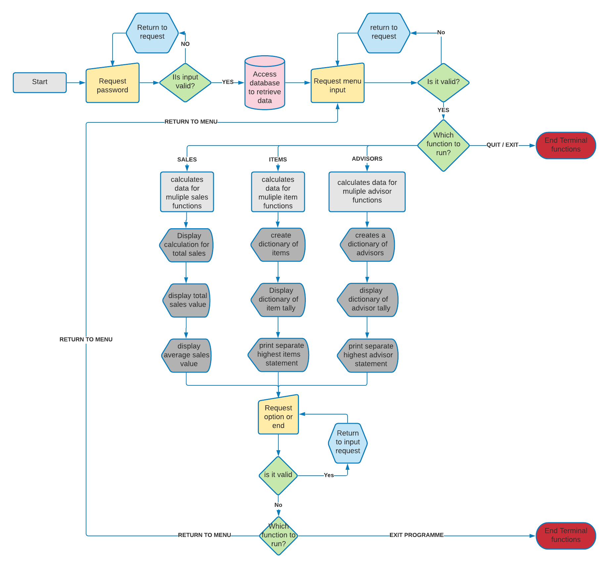
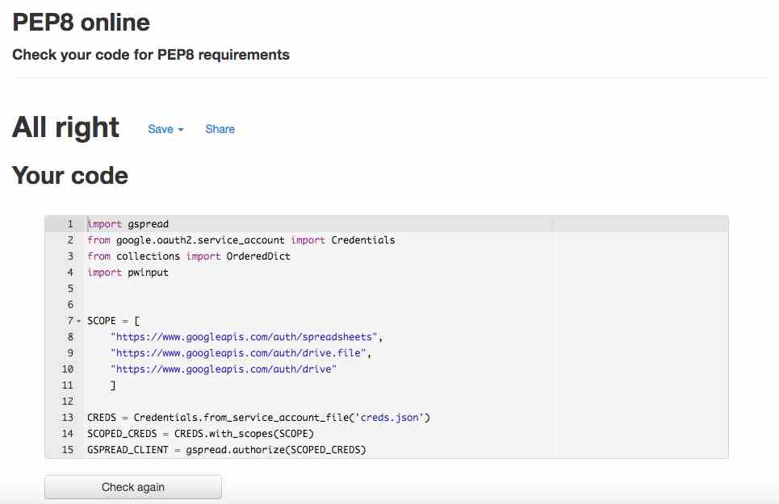

# **Promotional Sales Review System**

## # Table of contents

1. [Link To Live Site](#linktolivesite)
2. [LucidChart Diagram](#lucidchartdiagram)
3. [Overview](#overview)
4. [User Stories](#userstories)
5. [Initial Set Up](#initialsetup)
    1. [Google Form](#googleform)
    2. [Google Sheet](#googlesheet)
    3. [Google Cloud Platform](#googlecloudplatform)
    4. [GitHub](#github)
    5. [Terminal - Gitpod](#Terminalgitpod)
6. [Features](#features)
7. [Features to Implement](#featurestoimplement)
8. [Testing](#testing)
9. [Unfixed Bugs](#unfixedbugs)
10. [Deployment](#deployment)
    1. [Forking and Cloning](#forkingandcloning)
    2. [Local Deployment](#localdeployment)
    3. [Remote Deployment](#remotedeployment)
11. [Credits](#credits)

## Link to Live Site

https://promo-sales-review.herokuapp.com/ 

Please open in new window to avoid closing this window.

The password for this project in order to access the Promotional Sales Review System is MAGIC (caps specific).

## LucidChart Diagram

Here is the diagram I created to map out the flow of the app and how I wanted it to work:

## Overview

This is a system designed to review the promotional sales during the month. It is designed to be manager review only and will require a password to be put in correctly to activate the promo sales review system. Once the password is in, the first step is to retrieve the information from the input spreadsheet.

The App will complete a series of calculations on the data and produce results that are displayed in the terminal;
- Total sales, values and average per sale,
- Most popular item, and
- Advisor with most sales.

The system has evolved a couple of times; due to terminal size and dimensions, I have made further adjustments and required a method of shortening what was displayed in the terminal window;
- There is now a menu set up that allows the user to break down the information into choices that can be reviewed as many times and in any order, or to exit the terminal.
- It also gives the user an option to exit the terminal function at any point - either by choosing the exit option or by choosing not to continue with the program after viewing a section.

## User Stories

The first time you run this code should be at the end of the first day; this will then run the code and complete the first update for the promo sales review system.

The second and all further runs of the program will display the same information but will show the managers up-to-date performance information.

There will be some updates to the spreadsheets that will then allow further analysis to be displayed to the manager;
- As new information is inputted, the figures will be automatically updated to reflect the up-to-date information when the program is initiated.
- This can be updated as many times as needed and will always pull the up-to-date information.

## Initial Set Up Steps

Setting up this project requires a few steps based on the functionality and requirements;
- Google Form,
- Google Sheets,
- Google Cloud Platform,
- GitHub,
- Terminal.

### Google Form

The setup for the google form is relatively simple;
- Create a new form,
- Add a title to the document,
- Add the four different questions to the page: Date, Advisor, Item, Value,
- Set the requirements for each Question.
- On the responses page, click the green icon to create a spreadsheet for the responses.
- Once completed, this file needs to be made public so that anyone can access and view this form.

### Google sheet

The google sheet requires you to update the name of the spreadsheet before linking it to the GitPod editor. This must also be shared using the client email that is created as part of the creds.json file;
- In the Google Sheet, the top right button that reads 'Share',
- Click on it and add in the email address, making sure that Editor is marked so that we can edit or read from the form.
- Once completed, this file needs to be made public so that anyone can access and view this sheet.

### Google Cloud Platform

This requires the most complex setting up as this creates additional files that must be suitably and correctly added in specific ways. The process is listed in steps below to creating API Credentials:
- Create a new project (so that credentials are specific to the project), rename it and open it,
- Choose the APIS and services from the menu and choose a library,
- select the programs that are in use; Google Drive to start with as this is the storage space for the project. You would add google sheets API after completing the credentials part for drive API (you don't need to create the credentials for the sheet as well.)
- Once selected, you will need to enable the app, then create credentials from the option on the right:
    - Select which API to link (the app you selected),
    - Select which data to use (Application)
    - Select 'Not planning to use with compute engines'
    - Create a service name and click 'Create'
    - Make sure you make yourself editor on next section
    - Leave 'grant users access' blank, then select Done.
- You will now see the service account you created on the next page,
- Choose the keys tab and create a new key
- select the JSON file. (at this point you can now add the google sheets API to the service, but don't worry about the credentials again.)
- At this point you can download the credentials JSON file to use in your project file.

### GitHub

This is the hosting site for the project, so I created a new repository (in this case I used a template from Code Institute). Once it was created, I then used the Gitpod button to open the IDE to create the project.

### Terminal - Gitpod

For the terminal to be able to access the information for the functions to run, I have processed installations and imported libraries;
- I have installed gspread for using the google sheet manipulation and google-auth for accessing the correct google spreadsheet. I have also installed pwinput to allow users to input passwords with a mask to protect the user's input characters.
- I have imported the required libraries at the top of my run.py file for gspread, google.oauth.service_account, OrderedDict and pwinput.
- The JSON file downloaded from the Google Cloud Platform has been added to the file list, but IMMEDIATELY added to the gitignore file due to the sensitive information contained within the document, so as not to include in it my GitHub Repository.
- I have defined the scope for the document to be able to access the APIs mentioned in the Google cloud platform section for me to pull information from a separate service.
- Finally, I have defined my CONSTANT variables to make sure they do not change during the manipulation of the database.

## Features

The features of this app allow the user to manipulate data from a spreadsheet to allow managers to see a simple and analytical view of the inputted data. To complete these actions, the following features were implemented;
- A manager's login is requested; to protect the input, I have added code to mask the input but must still be inputted correctly to access the rest of the information.
- There is the main menu that can be returned to from the end of each journey; sales, items and advisor reviews. There is also a 'Quit/Exit' option to terminate the terminal program.
- These are passed through another validator before running the appropriate function of displaying relevant information based on the option chosen
    - The Sales option totals the number of sales, then displays total and average sales values.
    - The Item option displays a nice chart of each device that has been sold as part of the promotion and the number of sales for it. It also has a statement that displays the most popular item and the number of sales.
    - The Advisor option completes a similar journey to Item by displaying the advisors in the promotional sale as well as the number of sales made. This also has a statement that displays the summary information for the manager.
- At the end of each option, there is an input required if the user would like to return to the main menu or exit the app completely.

## Features to implement

The amount of information could be increased and more complex functions created to bring more math; such as pulling the total value sold for each device or the most popular device a particular advisor sells. These were too complex for my current program and would have caused issues with the size of the terminal being able to hold all the information on one screen.

## Testing

### Python

Code check has been processed on the Python Validator PEP8.

## Unfixed Bugs

There are currently no issues unresolved by the program.

There was an issue with the terminal display being too long and displaying all the information in one lump - This was fixed by implementing the menu system.
I had an issue regarding an infinite loop on the y/n validation check - this was resolved by moving the input statement to within the while True loop and adding an 'else' statement to deal with false returned results.

## Deployment

To deploy the project and allow other people to run the app and see it working, there are 3 methods to allow you to action this:

### Forking and Cloning Repositories

Accessing GitHub and navigating to my repositories will allow users to copy my code, either by forking or cloning:
Accessing my repository and clicking on the code button next to Gitpod link will bring up a drop-down to create a repository of your own in your own GitHub repo. You can also download a zip file and copy the information into a new file of your own making to continue working on it.

### Local Deployment

For my local deployment, I use Gitpod to edit and run my terminal;
- From GitHub, once the repository has been created (either as a new project or by forking/cloning) I will then click on the Gitpod button to implement the creation of a workspace to edit the promotional sales review system.

***The workspace should not be closed due to the creds file - as it is never added to GitHub, if you create a new workspace you will need to re-add the creds file and reinstall all libraries used each time. Pinning a workspace and accessing it from Gitpod rather than GitHub would prevent this loss of info***

### Remote Deployment

For users to run and test this app, I will be deploying the promotional sales review system to Heroku:
- Navigate to https://dashboard.heroku.com/apps, where you can then create a new app using the button on the right-hand side.
- Give it a relevant name and choose the correct location for the app (in my case, Europe.) Once set, click create.
- To make sure the deployment is correct we will make changes to the settings:
    - We, firstly, need to click on the Settings tab at the top of the page,
    - In the config vars section, we must click on reveal config vars.
    - We must add a KEY:VALUE pair - the first KEY is CREDS and the VALUE is the entire contents of the creds.json file.
    - We must also add a KEY called PORT and the VALUE is 8000 to make this app work correctly.
    - The buildpacks section below the config vars will need to the updated by clicking add buildpack - python must be added first and appear at the top of the list, then click save changes
    - The second buildpack you need to add is nodejs and save changes again after this one.
- Now we can head to the deploy section and we will be using GitHub for the method.
- Once you click on GitHub, you will then need to link the app to the correct repository from your GitHub profile - in my case, promo-sales-review.
- Once the app has searched and located the repo, you need to click connect for it to find the correct code to run.
- For the deployment method, I have chosen manual deployment, so I can locate the Manual deploy section and click 'deploy branch'. As I have chosen manual deployment, any changes that are made after this deployment will require me to manually redeploy the site.
- Once the code has finished running, it will display a success message and you can then view the app.

## Credits

The project was inspired by the Love Sandwiches walkthrough. Thank you to the Code Institute for showing me the processes required to create a project like this.

Thank you to the following people and sites for their advice and contributions to helping me understand and be able to confidently create this project:

- Chris Quinn - Mentor
- Iryna Sanzhara - Slack helper regarding my initial issues with validation check issues.
- https://pypi.org/project/pwinput/1.0.1/ - document explaining how to protect password input from anyone else viewing the input, improving user experience.
- https://thispointer.com/python-4-ways-to-print-items-of-a-dictionary-line-by-line/ - to help me display the information in a dictionary in a more easily read format to improve user experience.
- Slack - gleaning insights from other people's mentions and questions.
- Slack Overflow - providing some clues and information regarding issues that arose regarding validation of response in terminal inputs.
- GeekforGeeks - information regarding python functions and performances that would improve my app design.
- Code Institute - teaching me about the entire world of programming and introducing me to python and web development.